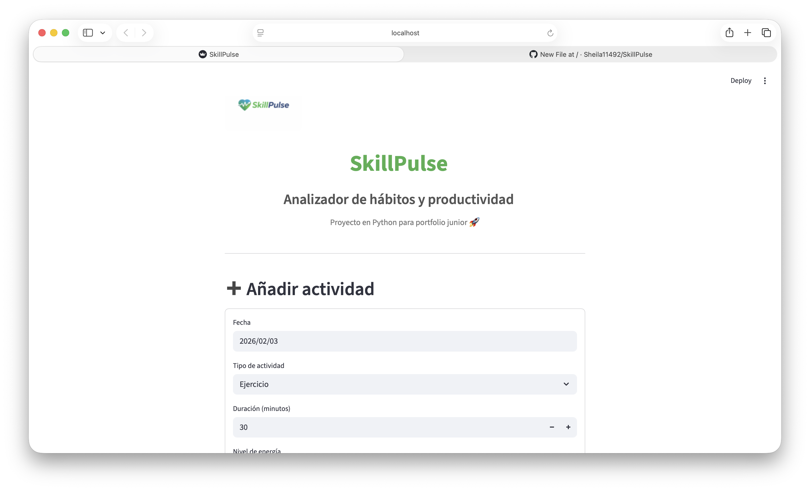
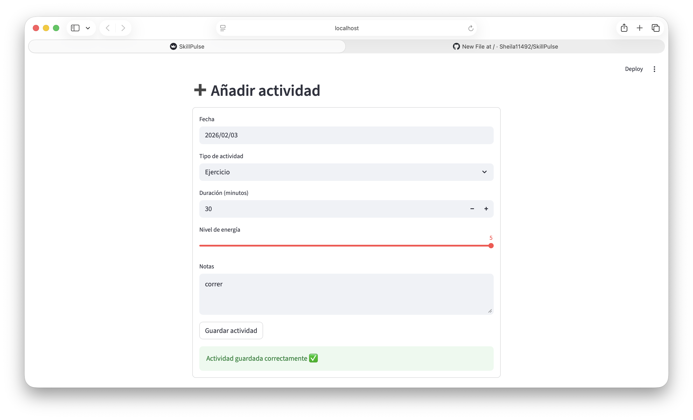
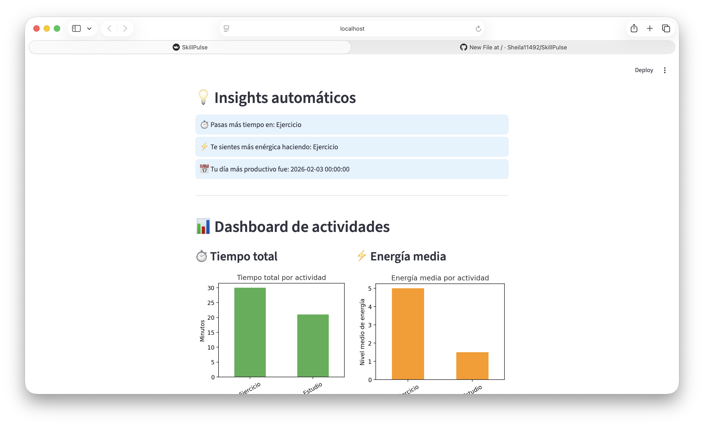
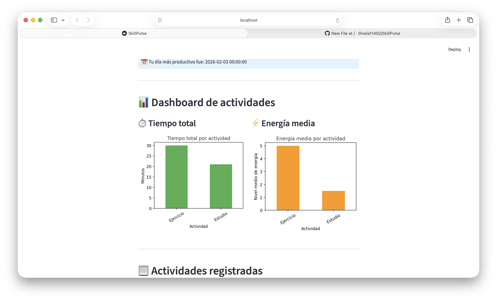
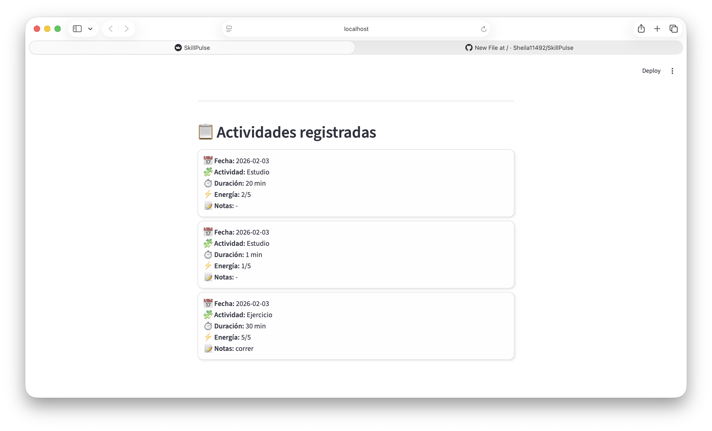

# SkillPulse ⚡📊

**SkillPulse** es una aplicación web desarrollada con **Python y Streamlit**, creada para el **análisis y seguimiento de hábitos y productividad personal**.

El objetivo del proyecto es disponer de una herramienta sencilla y visual para registrar actividades diarias, medir el tiempo dedicado a cada tipo de tarea y obtener insights automáticos sobre la productividad y energía.

Este proyecto forma parte de mi **portfolio personal** como desarrolladora junior y ha sido desarrollado de principio a fin aplicando buenas prácticas en Python y análisis de datos.

---

## 🚀 Funcionalidades principales

- Registro de **actividades diarias** (CRUD básico dentro de la sesión)
- Dashboard visual con gráficos:
  - Tiempo total por tipo de actividad
  - Nivel medio de energía por actividad
- Insights automáticos generados a partir de los datos registrados
- Listado de actividades en tarjetas con información completa:
  - Fecha, tipo de actividad, duración, energía y notas
- Interfaz sencilla y clara, enfocada en la usabilidad
- Posibilidad de exportar datos a CSV (opcional para futuras versiones)

---

## 🛠️ Tecnologías utilizadas

- **Python 3**
- **Streamlit** para la interfaz web
- **Pandas** para el manejo de datos
- **Matplotlib** para gráficos
- **SQLite** (a través de Python) para almacenamiento de actividades
- **Git & GitHub** para control de versiones
- **HTML / CSS** embebidos en Streamlit para tarjetas y estilo de dashboard

---

## 🧱 Arquitectura del proyecto

El proyecto sigue una estructura modular y clara, separando responsabilidades entre:

- **app.py** — Lógica principal de la aplicación y presentación
- **database.py** — Gestión de la base de datos SQLite
- **models.py** — Definición de modelos de datos (`Activity`)
- **analytics.py** — Funciones de análisis y generación de insights

### 📂 Estructura del proyecto

SkillPulse/
├─ app.py
├─ database.py
├─ models.py
├─ analytics.py
├─ skillpulse_logo.png
---

## 📷 Capturas de pantalla

  
  
  
  
 

---

## 🧪 Base de datos

- **SQLite** local
- Base de datos gestionada desde `database.py`
- Permite registrar y consultar actividades de forma persistente en la máquina local

---

## 📌 Objetivo del proyecto

Este proyecto ha sido desarrollado para:

- Practicar desarrollo de aplicaciones web con **Python y Streamlit**
- Aplicar análisis de datos y visualización de información
- Registrar hábitos y medir productividad personal
- Formar parte de mi **portfolio profesional como desarrolladora junior**

---

## 👩‍💻 Autora

**Sheila**  
Desarrolladora Junior  

📌 Proyecto desarrollado como parte de mi aprendizaje y portfolio personal.

---

## 📄 Licencia

Este proyecto se distribuye con fines educativos y personales.
